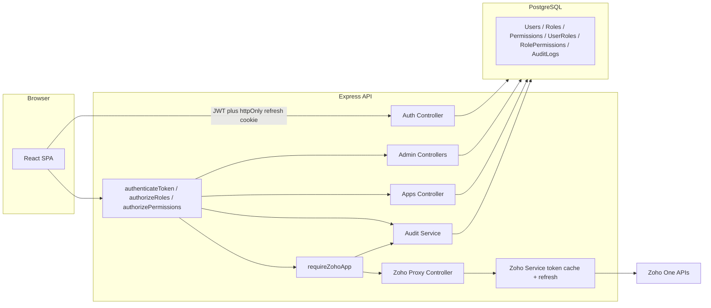
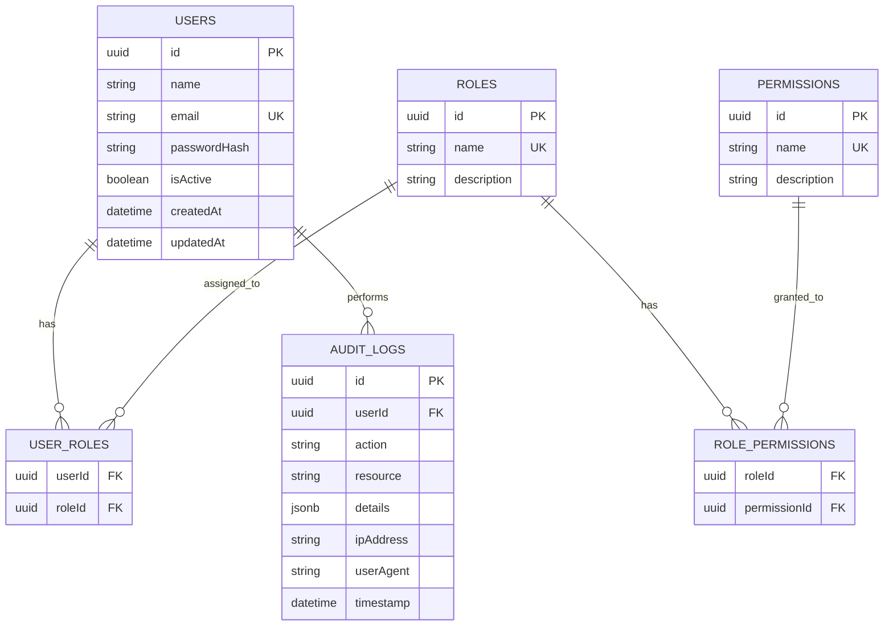
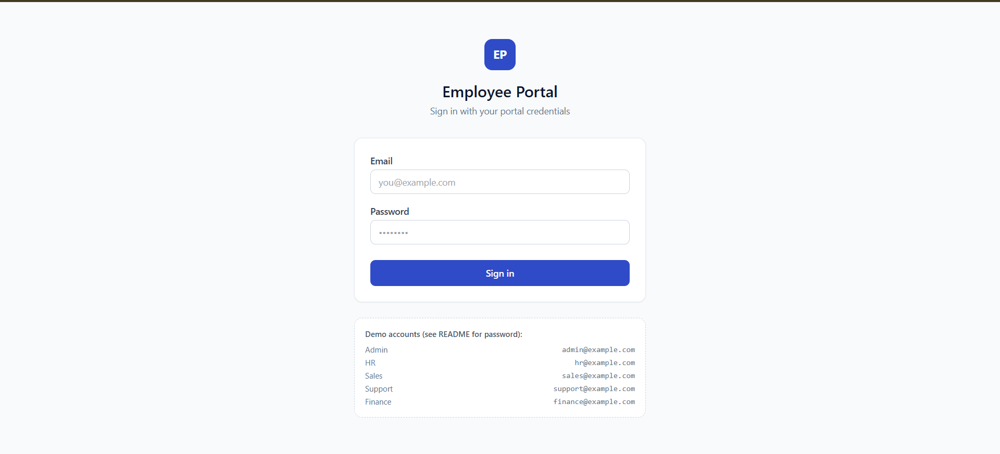
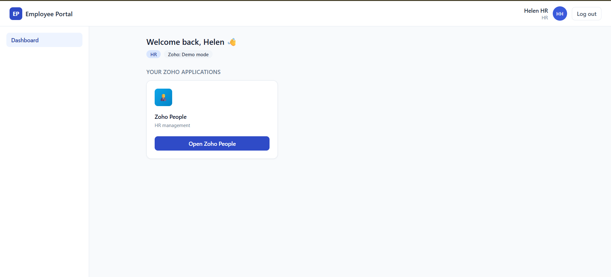
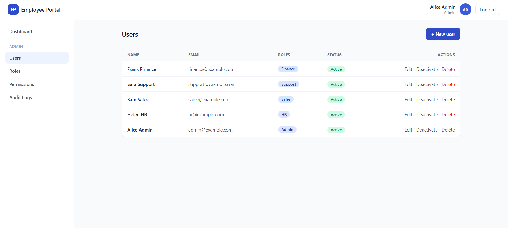
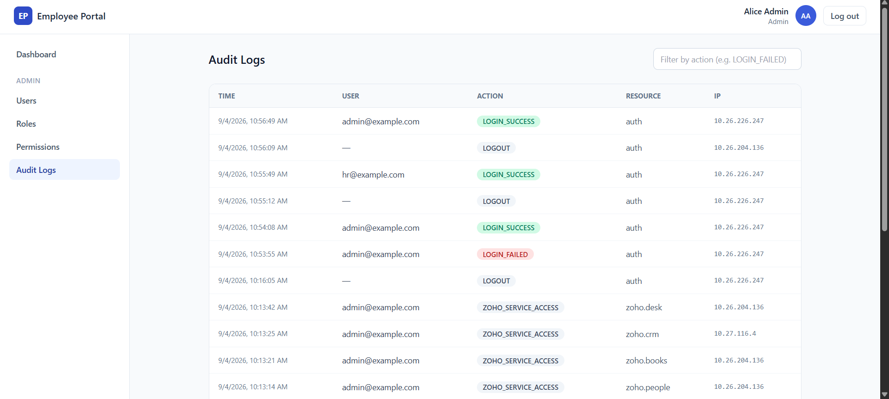

# Custom Employee Portal — Zoho One Integration

A full-stack employee portal with custom authentication, role-based access control (RBAC), an admin management panel, audit logging, and a backend-only Zoho One service-account integration.

Built for the "Custom Employee Portal with Zoho One Integration" hiring assignment.

---

## Table of Contents

1. [Project Overview](#project-overview)
2. [Business Problem](#business-problem)
3. [Features](#features)
4. [Tech Stack](#tech-stack)
5. [Architecture](#architecture)
6. [Folder Structure](#folder-structure)
7. [Database Schema](#database-schema)
8. [RBAC Explanation](#rbac-explanation)
9. [Role → Zoho App Mapping](#role--zoho-app-mapping)
10. [Authentication Flow](#authentication-flow)
11. [Zoho OAuth Flow](#zoho-oauth-flow)
12. [API Documentation](#api-documentation)
13. [Environment Variables](#environment-variables)
14. [Local Installation](#local-installation)
15. [Database Setup, Migrations, Seeding](#database-setup-migrations-seeding)
16. [Running the App](#running-the-app)
17. [Testing](#testing)
18. [Deployment](#deployment)
19. [Security Considerations](#security-considerations)
20. [Demo Credentials](#demo-credentials)
21. [Demo Flow (3–5 min)](#demo-flow-3-5-min)
22. [Screenshots](#screenshots)
23. [Future Improvements](#future-improvements)
24. [Interview Talking Points](#interview-talking-points)

---

## Project Overview

Employees today juggle separate logins for every Zoho One app they use (People, CRM, Desk, Books). This portal gives each employee **one login** and **one dashboard**, and shows them **only** the Zoho application(s) their role authorizes — without ever handing them individual Zoho credentials. All Zoho API traffic is proxied through the backend using a single service-account (OAuth refresh-token) integration.

## Business Problem

- Employees shouldn't need separate Zoho credentials or need to know which app they're allowed to use.
- Access to sensitive systems (Finance/Books, HR/People) must be enforced by role, and that enforcement must live on the server — not just be a matter of which button the UI happens to show.
- Admins need one place to manage who has access to what, and a record of who did what and when.

## Features

- Custom email/password authentication (bcrypt + JWT), no third-party auth provider
- Short-lived access tokens + httpOnly refresh-token cookie rotation
- Full RBAC: Users ↔ Roles ↔ Permissions, enforced in Express middleware on every request
- Admin panel: create/edit/deactivate/delete users, manage roles & permissions, assign roles
- Backend-enforced Zoho app authorization — unauthorized calls return `403`, regardless of the frontend
- Single backend Zoho One service-account integration (self-client OAuth refresh-token flow) — employees never see or enter Zoho credentials
- Zoho "demo mode": the whole app runs and can be reviewed **without** a real Zoho subscription, using clearly-labeled mock data; supplying real `ZOHO_*` env vars flips it to live calls
- Real audit logging (login success/failure, logout, user/role/permission changes, unauthorized access attempts, Zoho access) with filter/search/pagination
- Centralized error handling with correct HTTP status codes
- Helmet, CORS, rate limiting (login-specific + general), input validation, parameterized queries via Sequelize
- Responsive, modern UI: dashboard, admin tables, toasts, confirm dialogs, loading/empty/error states

## Tech Stack

**Frontend:** React 18, Vite, React Router 6, Axios, Tailwind CSS
**Backend:** Node.js, Express, JWT (`jsonwebtoken`), `bcryptjs`, `express-validator`, Helmet, CORS, `express-rate-limit`
**Database:** PostgreSQL + Sequelize ORM (migrations + seeders via `sequelize-cli`)
**Testing:** Jest + Supertest
**Deployment targets:** Frontend → Vercel · Backend → Render/Railway · DB → Supabase/Neon/Render Postgres

## Architecture



### Database ER Diagram



## Folder Structure

```
custom-employee-portal/
  backend/
    src/
      config/        env.js, database.js, config.js (sequelize-cli), zohoAppMap.js
      controllers/   authController, appsController, zohoController, admin/*
      middleware/    auth.js, errorHandler.js, rateLimiter.js, validate.js, zohoAuthorize.js
      models/        User, Role, Permission, UserRole, RolePermission, AuditLog, index.js
      routes/        authRoutes, appsRoutes, zohoRoutes, adminRoutes
      services/      tokenService.js, zohoService.js, auditService.js
      validators/    authValidators.js, adminValidators.js
      seeds/         seed.js
      app.js
      server.js
    migrations/      6 sequelize migrations
    tests/           auth.test.js, rbac.test.js, setup.js
    postman_collection.json
    .env
    package.json

  frontend/
    src/
      components/    Navbar, Sidebar, ApplicationCard, Badge, ConfirmDialog, LoadingSpinner, ErrorMessage, EmptyState
      pages/         Login, Dashboard, Unauthorized, admin/{AdminUsers,AdminRoles,AdminPermissions,AdminAuditLogs}
      layouts/       AppLayout.jsx
      routes/        ProtectedRoute.jsx, RoleGuard.jsx
      context/       AuthContext.jsx, ToastContext.jsx
      services/      api.js (axios + refresh interceptor), endpoints.js
      App.jsx, main.jsx
    .env
    package.json

  docs/
    screenshots/
      login.png
      admin-dashboard.png
      hr-dashboard.png
      admin-users.png
      audit-logs.png

  README.md
  .gitignore
```

## Database Schema

| Table | Purpose |
|---|---|
| `Users` | id, name, email (unique), passwordHash, isActive, timestamps |
| `Roles` | id, name (unique — Admin/HR/Sales/Support/Finance), description |
| `Permissions` | id, name (unique, e.g. `zoho.crm.access`), description |
| `UserRoles` | join table, unique (userId, roleId), cascades on delete |
| `RolePermissions` | join table, unique (roleId, permissionId), cascades on delete |
| `AuditLogs` | id, userId (nullable, SET NULL on user delete), action, resource, details (JSONB), ipAddress, userAgent, timestamp |

A user can hold multiple roles (many-to-many via `UserRoles`); a role can hold multiple permissions (many-to-many via `RolePermissions`). Permissions are deliberately **not** hard-coded onto roles in application logic — they're data, so an admin can regrant/revoke without a code deploy.

## RBAC Explanation

RBAC is enforced in three layers, and **all three run on the server**:

1. `authenticateToken` — verifies the JWT, loads the user's *current* roles/permissions from the DB (not just what was baked into the token), attaches them to `req.user`.
2. `authorizeRoles(...roles)` / `authorizePermissions(...perms)` — Express middleware that runs before the route handler and returns `403` if the user doesn't qualify. `Admin` always passes.
3. `requireZohoApp(appKey)` — a specialized authorization step for the Zoho proxy: checks the requested Zoho module against the same role→app map used by `/api/apps`, so what the dashboard shows and what the backend allows can never drift apart (single source of truth: `src/config/zohoAppMap.js`).

The frontend's `RoleGuard` component only hides navigation/routes for a smoother UX — it is explicitly documented in code as **not** the security boundary. Every admin and Zoho endpoint independently re-checks authorization no matter what the UI rendered.

## Role → Zoho App Mapping

| Role | Zoho Application | Purpose |
|---|---|---|
| HR | Zoho People | HR management |
| Sales | Zoho CRM | Sales & customer relationship management |
| Support | Zoho Desk | Support ticketing & case management |
| Finance | Zoho Books | Financial & accounting operations |
| Admin | All of the above | Full portal + Zoho access |

Defined once in `backend/src/config/zohoAppMap.js` and consumed by both `GET /api/apps` (what the dashboard shows) and the Zoho proxy middleware (what the backend actually allows).

## Authentication Flow

1. `POST /api/auth/login` — email + password, `bcrypt.compare()` against the stored hash.
2. On success: a short-lived **access token** (JWT, default 15m) is returned in the JSON body, and a long-lived **refresh token** (JWT, default 7d) is set as an **httpOnly, SameSite** cookie scoped to `/api/auth`.
3. The frontend keeps the access token **in memory only** (never localStorage/sessionStorage) and attaches it as `Authorization: Bearer <token>` on every request.
4. When an API call returns `401`, an axios interceptor calls `POST /api/auth/refresh` (the browser sends the httpOnly cookie automatically); on success it retries the original request with the new access token. If refresh also fails, the user is signed out client-side.
5. `POST /api/auth/logout` clears the refresh cookie server-side.

**Why JWT?** Stateless verification means any backend instance can validate a request without a shared session store — this matters once the API is horizontally scaled on Render/Railway. Roles/permissions are re-fetched from the DB on every request rather than trusted from the token payload, so a revoked role takes effect immediately rather than waiting for token expiry.

## Zoho OAuth Flow

The portal uses **one Zoho One service account** — a self-client OAuth "refresh token" grant, not per-user Zoho login:

1. Admin generates a Self Client in the [Zoho API Console](https://api-console.zoho.com/), grants it the scopes needed for People/CRM/Desk/Books, and obtains a one-time authorization code, which is exchanged for a long-lived `refresh_token`.
2. That `refresh_token`, plus `client_id`/`client_secret`, are stored **only** as backend environment variables — never sent to the frontend, never logged.
3. `src/services/zohoService.js` exchanges the refresh token for a short-lived `access_token` on demand, caches it in memory, and transparently re-fetches it ~30s before expiry.
4. Every Zoho proxy request goes: **authenticate user → check role authorizes this app (`requireZohoApp`) → call Zoho with the cached service-account token → return the response.** The Zoho access token itself is never forwarded to the browser.
5. **Demo mode:** if `ZOHO_CLIENT_ID`/`ZOHO_CLIENT_SECRET`/`ZOHO_REFRESH_TOKEN` are unset, `zohoService` skips the real HTTP call and returns clearly-labeled mock JSON (`_demoMode: true`) instead — so the RBAC/UI/portal can be fully exercised without a live Zoho subscription, and nobody can mistake demo output for a real integration.

**Why keep Zoho credentials on the backend?** A compromised frontend (XSS, malicious extension, etc.) can never leak Zoho secrets it was never given. It also means individual employees never hold Zoho credentials that could be phished or reused elsewhere — access is entirely a function of their portal role.

## API Documentation

All endpoints are prefixed with the backend's base URL (e.g. `http://localhost:5000`). Protected routes require `Authorization: Bearer <accessToken>`.

### Auth

| Method | Path | Auth | Description |
|---|---|---|---|
| POST | `/api/auth/login` | — | `{ email, password }` → `{ accessToken, user }`. Sets httpOnly refresh cookie. `401` on bad credentials. Rate-limited. |
| POST | `/api/auth/refresh` | refresh cookie | Issues a new access token from the refresh cookie. |
| POST | `/api/auth/logout` | — | Clears the refresh cookie. |
| GET | `/api/auth/me` | Bearer | Returns the current user with roles/permissions. |

### Apps

| Method | Path | Auth | Description |
|---|---|---|---|
| GET | `/api/apps` | Bearer | Returns only the Zoho apps the caller's roles authorize, e.g. `{ apps: [{ name: "Zoho People", key: "people" }], demoMode: false }`. |

### Zoho Proxy

| Method | Path | Auth | Description |
|---|---|---|---|
| GET | `/api/zoho/people(/...)` | Bearer + HR or Admin | Proxies to Zoho People. `403` for other roles. |
| GET | `/api/zoho/crm(/...)` | Bearer + Sales or Admin | Proxies to Zoho CRM. |
| GET | `/api/zoho/desk(/...)` | Bearer + Support or Admin | Proxies to Zoho Desk. |
| GET | `/api/zoho/books(/...)` | Bearer + Finance or Admin | Proxies to Zoho Books. |

### Admin (all require Bearer + `Admin` role)

| Method | Path | Description |
|---|---|---|
| GET | `/api/admin/users` | List all users with roles |
| POST | `/api/admin/users` | Create user `{ name, email, password, roleIds? }` |
| PUT | `/api/admin/users/:id` | Update `{ name?, email?, isActive?, roleIds? }` |
| DELETE | `/api/admin/users/:id` | Delete a user (cannot delete yourself) |
| GET | `/api/admin/roles` | List roles with permissions |
| POST | `/api/admin/roles` | Create role `{ name, description?, permissionIds? }` |
| PUT | `/api/admin/roles/:id` | Update role / reassign permissions |
| DELETE | `/api/admin/roles/:id` | Delete role (blocked if still assigned to users, or if `Admin`) |
| GET | `/api/admin/permissions` | List permissions |
| POST | `/api/admin/permissions` | Create permission `{ name, description? }` |
| GET | `/api/admin/audit-logs` | `?action=&userId=&from=&to=&page=&pageSize=` — paginated, filterable |

A ready-to-import Postman collection is at `backend/postman_collection.json`.

**Status codes used throughout:** `200` success · `201` created · `400` validation error · `401` unauthenticated · `403` forbidden · `404` not found · `409` conflict · `500` server error.

## Environment Variables

### Backend (`backend/.env`, see `backend/.env.example`)

| Variable | Purpose |
|---|---|
| `NODE_ENV`, `PORT` | Server runtime config |
| `BACKEND_URL`, `FRONTEND_URL` | Used for CORS origin and self-reference; no hardcoded localhost in deployed configs |
| `DATABASE_URL`, `DB_SSL` | Postgres connection string (Supabase/Neon/Render all provide one) |
| `JWT_ACCESS_SECRET`, `JWT_REFRESH_SECRET` | Long random strings — **never commit real values** |
| `JWT_ACCESS_EXPIRES_IN`, `JWT_REFRESH_EXPIRES_IN` | Token lifetimes (defaults `15m` / `7d`) |
| `COOKIE_SECURE` | `true` in production (HTTPS required for `Secure` cookies) |
| `LOGIN_RATE_LIMIT_WINDOW_MS`, `LOGIN_RATE_LIMIT_MAX` | Login brute-force protection |
| `ZOHO_CLIENT_ID`, `ZOHO_CLIENT_SECRET`, `ZOHO_REFRESH_TOKEN` | Service-account Zoho credentials — leave blank for demo mode |
| `ZOHO_ACCOUNTS_URL`, `ZOHO_API_BASE_URL` | Zoho data-center endpoints (e.g. `.com`, `.eu`, `.in`) |
| `DEMO_PASSWORD` | Password used by `npm run seed` for all demo users |

### Frontend (`frontend/.env`, see `frontend/.env.example`)

| Variable | Purpose |
|---|---|
| `VITE_API_BASE_URL` | Base URL of the backend API, e.g. `https://your-backend.onrender.com/api` |

## Local Installation

Prerequisites: Node.js 18+, npm, and a PostgreSQL database (local, or a free Supabase/Neon instance).

```bash
git clone <this-repo>
cd custom-employee-portal

# Backend
cd backend
cp .env.example .env      # then edit DATABASE_URL, JWT secrets, etc.
npm install

# Frontend
cd ../frontend
cp .env.example .env
npm install
```

## Database Setup, Migrations, Seeding

```bash
cd backend

# Run migrations (creates all 6 tables with FKs/indexes)
npm run migrate

# Seed roles, permissions, and 5 demo users
npm run seed
```

`npm run migrate:undo` rolls back the most recent migration if needed.

## Running the App

```bash
# Terminal 1 — backend (http://localhost:5000)
cd backend
npm run dev

# Terminal 2 — frontend (http://localhost:5173)
cd frontend
npm run dev
```

Open http://localhost:5173 and log in with any demo account below.

## Testing

```bash
cd backend
# Tests run against DATABASE_URL (or TEST_DATABASE_URL if set) and
# rebuild the schema with sequelize.sync({ force: true }) — point this
# at a disposable/test database, not production.
npm test
```

Covers: valid/invalid login, missing/invalid/expired JWT, per-role visibility of `/api/apps`, backend `403` when a role calls a Zoho endpoint it doesn't own (e.g. Sales → Books), Admin succeeding on every Zoho endpoint, and non-admins receiving `403` from admin APIs.

A Postman collection (`backend/postman_collection.json`) is provided for manual/exploratory testing.

## Deployment

**Frontend → Vercel**
1. Import the `frontend/` directory as the project root.
2. Build command `npm run build`, output directory `dist`.
3. Set `VITE_API_BASE_URL` to your deployed backend's `/api` URL.

**Backend → Render or Railway**
1. Root directory `backend/`, build command `npm install`, start command `npm start`.
2. Set all backend environment variables from the table above — in particular `FRONTEND_URL` (your Vercel URL, so CORS allows it), `DATABASE_URL`, both JWT secrets, and `COOKIE_SECURE=true`.
3. Run `npm run migrate && npm run seed` once (via a one-off job/shell) against the production database.

**Database → Supabase / Neon / Render Postgres**
1. Create a Postgres instance, copy its connection string into `DATABASE_URL`.
2. Enable `DB_SSL=true` if the provider requires SSL (Supabase/Neon/Render all do by default).

No localhost URLs are hardcoded anywhere in the codebase — CORS origin, cookie domain behavior, and API base URL are all environment-driven.

## Security Considerations

- Passwords hashed with `bcryptjs` (cost factor 12) — plaintext passwords are never stored or logged.
- JWT access tokens are short-lived; refresh tokens live only in an **httpOnly** cookie (inaccessible to JS, mitigating XSS token theft) with `SameSite` protection and `Secure` in production.
- RBAC is enforced in backend middleware on every protected route — the frontend's route guards are UX-only and are explicitly documented as such in code.
- Helmet sets standard security headers; CORS is locked to `FRONTEND_URL` with `credentials: true`.
- Login endpoint is rate-limited separately from the rest of the API to blunt credential-stuffing.
- All input is validated with `express-validator` before touching the database.
- All queries go through Sequelize (parameterized), eliminating classic SQL injection vectors.
- Centralized error handler never leaks stack traces or internal details in production responses.
- Zoho client secret and refresh token exist **only** as backend env vars; the Zoho access token obtained from them is never returned to the browser.
- `.env` is git-ignored in both `backend/` and `frontend/`; only `.env.example` files (no real secrets) are committed.
- Admin APIs re-verify the `Admin` role server-side on every request — hiding the admin nav item is not treated as a security control.
- Deleting your own admin account is blocked; deleting a role still assigned to users is blocked; the built-in `Admin` role cannot be deleted.

## Demo Credentials

Seeded by `npm run seed` (password is whatever you set as `DEMO_PASSWORD` in `backend/.env`, default `Passw0rd!123`):

| Role | Email |
|---|---|
| Admin | admin@example.com |
| HR | hr@example.com |
| Sales | sales@example.com |
| Support | support@example.com |
| Finance | finance@example.com |

> **These are development/demo credentials only.** Change or remove them before any production deployment.

## Demo Flow (3–5 min)

1. Log in as `hr@example.com` → dashboard shows **only** the Zoho People card.
2. Click it → backend proxies to Zoho People (demo data if `ZOHO_*` env vars are unset) and shows a success toast.
3. Open dev tools / Postman and call `GET /api/zoho/crm` with the HR user's token → **403 Forbidden**, proving backend enforcement (not just hidden UI).
4. Log out, log in as `admin@example.com` → dashboard shows all four Zoho apps, plus an **Admin** sidebar section.
5. In Admin → Users, create a new user and assign the `Sales` role; show that they'd now only see Zoho CRM.
6. Open Admin → Audit Logs → point out the `LOGIN_FAILED`, `ZOHO_ACCESS_DENIED`, and `USER_CREATED` entries generated during this walkthrough.

## Screenshots

### Login



### Admin Dashboard



### HR Dashboard



### Admin Users


### Audit Logs



## Future Improvements

- Manager role (optional per the original brief) with department-scoped visibility
- Refresh-token rotation with a server-side denylist for immediate revocation
- WebSocket-based live audit log stream on the admin dashboard
- CSV export for audit logs and user lists
- Automated e2e tests (Playwright) covering the full login → dashboard → Zoho-access flow
- Multi-region Zoho data-center support (auto-detect `.com`/`.eu`/`.in`)

## Interview Talking Points

- **Why JWT?** Stateless, horizontally scalable verification; no server-side session store needed across multiple backend instances.
- **Why RBAC?** Access decisions map cleanly to job function (HR needs People, not Books) and are auditable/centrally managed rather than scattered through code.
- **Why separate permissions from roles?** Roles are a convenient bundle, but fine-grained permissions (e.g. `admin.audit-logs.view`) let you compose new roles or tweak an existing one without redefining what "Admin" means everywhere in the codebase.
- **Why do Zoho credentials stay on the backend?** The frontend is the least trusted part of the system (public, user-controlled browser); secrets it never receives can't leak from it.
- **How are unauthorized requests prevented?** Every protected route runs `authenticateToken` then `authorizeRoles`/`authorizePermissions`/`requireZohoApp` before the handler executes — enforcement is structural, not incidental.
- **How does audit logging work?** A single `logAudit()` helper writes to the `AuditLogs` table; it's called from both success and failure paths (including inside the authorization middleware itself), and failures to write a log never break the underlying request.
- **How does token refresh work?** Access tokens are short-lived and kept in memory; an axios response interceptor catches `401`s, calls `/api/auth/refresh` (which reads the httpOnly cookie), and retries the original request once.
- **How does the frontend talk to the backend?** A single axios instance (`services/api.js`) with `withCredentials: true`, request/response interceptors for the bearer token and refresh-on-401, and a thin `endpoints.js` layer grouping calls by resource.

